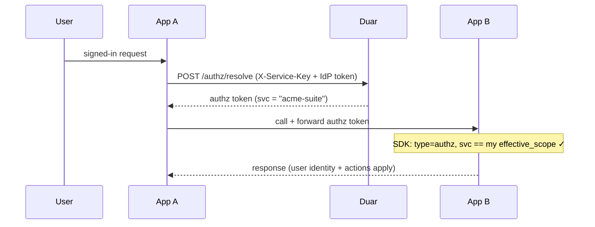
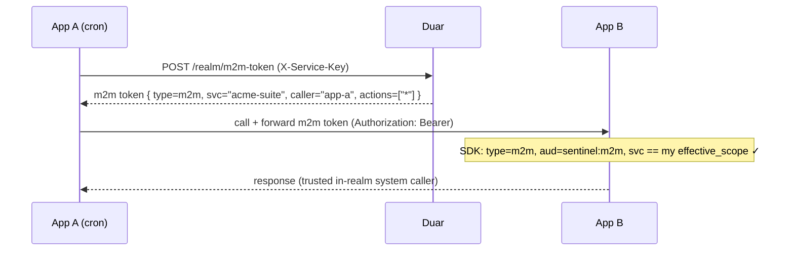

# Realms

A **realm** is a named group of service apps that fully trust each other. Membership gives the group:

- **Shared sign-in** — a user's authz token works on every member app.
- **Shared permissions** — all members read and write entity ACLs and RBAC actions under one shared scope.
- **Trusted app-to-app calls** — members call each other's APIs both *with* a signed-in user and *with no user at all*, every call credentialed and validated by Duar.

Apps in a realm carry **no auth logic and no realm config** — the SDK self-discovers the realm from Duar. Standalone service apps are unaffected: a realm is opt-in and non-breaking.

!!! note "Realm vs Group"
    A **realm** is a trust boundary over *service apps*. A [Group](groups.md) is a collection of *users* within a workspace (a Tier-3 ACL grantee). Different concepts, no overlap.

## Shared scope (`effective_scope`)

Every service app is normally isolated by its unique `service_name`: permissions and RBAC actions registered under `billing` are invisible to `reports`. A realm collapses that dimension.

Each realm has a `slug` (e.g. `acme-suite`). For a member, the slug becomes the **effective scope** — the value substituted for `service_name` everywhere permissions and tokens are scoped:

```
effective_scope = realm.slug   if the service is a realm member
                = service_name otherwise (standalone — today's behavior)
```

So two members `reports` and `billing` in realm `acme-suite` both read and write permission rows and RBAC actions under `acme-suite`, and a token minted for one validates on the other. Workspaces are **orthogonal** — `workspace_id` scoping is unchanged; a realm only shares the `service_name` dimension.

A service app belongs to **at most one realm** (an ambiguous scope otherwise).

## Token flows

A realm enables two app-to-app call patterns. In both, trust is rooted in Duar's RS256 signature — never in app-to-app trust.

### Flow A — user-context

A human is behind the call. App A forwards the user's authz token to App B; because the token's `svc` claim is the realm slug, App B accepts it.



### Flow B — no-user

A background/system call with no human (a cron job, a queue worker). App A mints a short-lived **realm m2m token** with its service key and presents it to App B.



The m2m token carries **no user claims** — it is an honest "no human" credential carrying service identity only. See [Python SDK → Realms & M2M](../sdk/realms.md) and [JS Server Utilities](../js-sdk/server.md) for the SDK calls (`mint_m2m_token` / `M2mTokenClient`, `verify_m2m_token` / `verifyM2mToken`).

## Trust model

Two independent, Duar-rooted checks — apps never trust each other directly:

- **Mint-time** (App A → Duar): the m2m endpoint is gated by the service key. The token's `caller` and `svc` are **server-stamped from the authenticated key**, never client-asserted — so a leaked key can only mint *that member's* token, and cannot impersonate another member or jump realms. Minting is rejected unless the service is an active member of an active realm.
- **Present-time** (App A → App B): App B verifies Duar's RS256 signature over JWKS, plus `aud == sentinel:m2m`, `svc == effective_scope` (a cross-realm replay fails), and a short expiry.

| Threat | Defense |
|---|---|
| Forged / fabricated token | RS256 signature — unforgeable without Duar's private key |
| Stolen service key | high-entropy, hashed, backend-only, rotatable; server-stamped identity blocks impersonation |
| Stolen token in transit | short TTL + TLS + `svc` binding |
| Malicious member | v1 is full in-realm trust by design; the reserved `actions` field is the future least-privilege lever |

The m2m audience (`sentinel:m2m`) is deliberately separate from the user audiences (`sentinel:access`, `sentinel:authz`, `sentinel:admin`) so a user-token validator can never accept an m2m token as a user.

For the hard **network isolation** that puts the entire service-key surface (including `/realm/*`) on an unpublished internal listener, see [Deployment → Network Split](../deployment/index.md#network-split-public--internal-listeners).

## Managing realms (admin)

Realms are created and managed in the admin panel (**Realms** in the nav) — they back the `/admin/realms` API ([API reference](../api/realms.md#admin-endpoints)).

1. **Create a realm** — give it a display **name** and a **slug**. The slug is the shared scope; it must start with a letter and match `^[a-z][a-z0-9-]*[a-z0-9]$`, and is **immutable after create** (changing it would orphan every permission row written under it). Optionally set **m2m token TTL** (`m2m_ttl_s`, default 300s, range 30–3600).
2. **Add members** — pick standalone service apps (apps already in another realm are not selectable). One realm max per app.
3. **Remove members** or **deactivate the realm** (`is_active = false`) to kill m2m minting without deleting anything.
4. **Delete** requires typing the realm name to confirm (the standard destructive-action guard). On delete, members' `realm_id` is set to `NULL` — they revert to standalone.

Every mutation is audit-logged (`realm_created`, `realm_updated`, `realm_deleted`, `realm_member_added`, `realm_member_removed`).

!!! warning "Joining with existing grants"
    A standalone service that already has permission or RBAC rows under its own `service_name` will **not** see them once it joins a realm — its scope changes to the realm slug. The admin UI flags a member that `has_grants` when you add it. v1 does **not** auto-migrate; realms target new app-suites. See limitations below.

## Migration and limitations

- Adding the `realms` table and the nullable `service_apps.realm_id` column is **non-breaking** — no backfill, standalone apps behave exactly as before.
- **No auto-migration** of a joining service's pre-existing grants (a re-keying tool is future work). Plan realm membership before a service accumulates grants, or re-register its resources/actions under the realm slug.
- **One realm per service** — multi-realm membership is not supported.
- The `actions: ["*"]` field on m2m tokens is **full trust** in v1; per-member least-privilege is a future enhancement that needs no token-shape change.

## Related

- [Authorization](authorization.md) — the three-tier model a realm shares across members
- [Service Apps](service-apps.md) — the apps a realm groups
- [API → Realms](../api/realms.md) — the `/realm/*` and `/admin/realms` endpoints
- [Python SDK → Realms & M2M](../sdk/realms.md) and [JS Server Utilities](../js-sdk/server.md) — minting and accepting m2m tokens
- [Deployment → Network Split](../deployment/index.md#network-split-public--internal-listeners) — the public/internal listener posture
