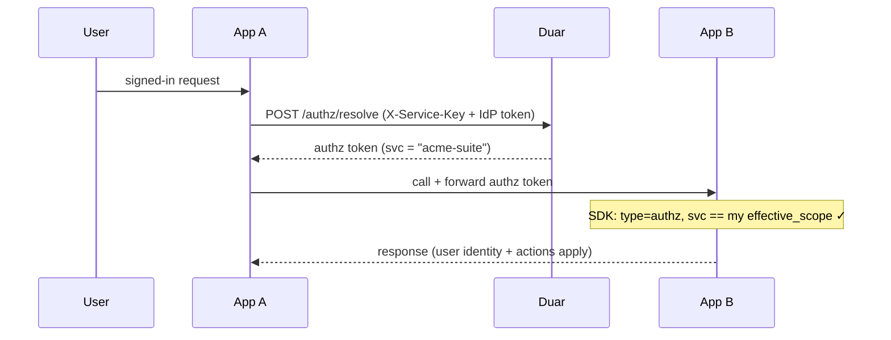
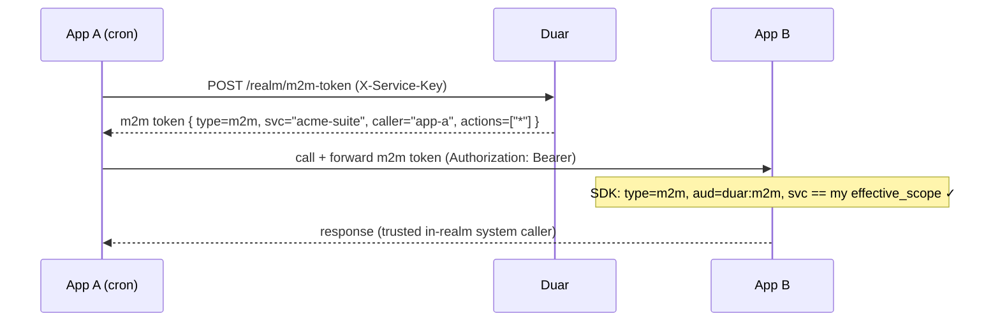

# Realm Docs Implementation Plan (Plan 6 — final)

> **For agentic workers:** REQUIRED SUB-SKILL: Use superpowers:subagent-driven-development (recommended) or superpowers:executing-plans to implement this plan task-by-task. Steps use checkbox (`- [ ]`) syntax for tracking.

**Goal:** Document the Realms / trusted-app-group feature and no-user m2m across the MkDocs site — guide, API reference, Python SDK, JS SDK, and the public/internal network-split deployment posture — so the shipped backend (Plans 1–4) and SDK (Plan 5) surface is fully covered and the docs CI gate (`mkdocs build --strict`) stays green.

**Architecture:** Pure documentation. Three new pages (`guide/realms.md`, `api/realms.md`, `sdk/realms.md`) plus edits to four existing pages (`js-sdk/server.md`, `js-sdk/nextjs.md`, `deployment/index.md`, `deployment/environment.md`) and three cross-reference touch-ups (`guide/authorization.md`, `guide/service-apps.md`, `sdk/index.md`). Each new page is wired into `mkdocs.yml` nav in the same task (strict mode fails on any page absent from nav, and on any broken internal link). No code is touched.

**Tech Stack:** MkDocs Material. Build/verify: `uv run --extra docs mkdocs build --strict` (the exact CI command, `.github/workflows/docs.yml:40`). Live preview: `make docs-serve`. Mermaid fences are enabled (`mkdocs.yml` superfences config).

## Global Constraints

- **This plan touches ONLY `docs/` and `mkdocs.yml`.** It never goes near `service/`, `sdk/`, or `sdks/` source. The user's uncommitted `service/src/services/role_service.py` + `service/tests/test_register_actions.py` are therefore untouched by construction — **do not stray into them.**
- **Stage only the files each task lists** (`git add <those paths>`); never `git add -A` / `git add .`. Commit after every task.
- **Verification is the same for every task:** from the repo root, `uv run --extra docs mkdocs build --strict` must exit 0 with no `WARNING`/`ERROR` lines. Strict mode treats a page-not-in-nav and a dead internal link as build failures — that is the test. (If `uv sync --extra docs` has never run in this environment, run it once first; `pyproject.toml:14-18` pins the docs deps.)
- **Every new `.md` page MUST be added to the `nav:` tree in `mkdocs.yml` in the same task that creates it** — otherwise strict build fails with "page exists but not in nav".
- **Internal links use source filenames** (MkDocs `use_directory_urls` default): same-dir `[x](authorization.md)`, cross-dir `[x](../sdk/realms.md)`. Anchors are the auto-slug of a heading (`## Flow B` → `#flow-b`). Only link to headings that exist.
- **Match the existing terse house style:** short prose, tables, fenced code blocks, occasional mermaid. No marketing voice. US spelling. Reuse the exact identifiers from the code — do not invent field names.
- **Facts are frozen from the shipped code** (verified against `service/src/main.py`, `service/src/api/realm_routes.py`, `service/src/schemas/realm.py`, `service/src/auth/jwt.py`, `sdk/src/duar_auth/`, `sdks/js/src/`, `docker-compose.prod.yml`). The verbatim content blocks below are the deliverable — transcribe them, adjust only to fix a strict-build link/anchor error. Do not re-derive the API from scratch.
- Branch: `realm-trusted-app-group` (already checked out).
- **SDD housekeeping (before dispatching Task 1):** archive the current `.superpowers/sdd/progress.md` → `progress-plan5-archive.md`, start a fresh ledger, and **regenerate each `task-N-brief` from THIS plan file** (the brief slots hold stale Plan-5 content otherwise). One implementer at a time.

## Out of scope (deferred — confirm with user if wanted)

- **Cross-SDK end-to-end integration tests** (two real apps exercising Flow A/B against a live internal listener). Floated in the Plan-5 doc's "Known integration gaps", but the handoff scopes Plan 6 as docs-only, and the shipped unit suites (330 backend + the Plan-5 SDK suites) already cover each side. Not built here.
- **Re-keying migration tool** for a service joining a realm with pre-existing grants (spec "Future work"). Documented as a known limitation in the guide, not implemented.

## File map

| # | Task | Create | Modify | Nav |
|---|------|--------|--------|-----|
| 1 | Guide: Realms | `docs/guide/realms.md` | `guide/authorization.md`, `guide/service-apps.md`, `mkdocs.yml` | + Guide → Realms |
| 2 | API: Realms | `docs/api/realms.md` | `mkdocs.yml` | + API Reference → Realms |
| 3 | Python SDK: Realms & M2M | `docs/sdk/realms.md` | `sdk/index.md`, `mkdocs.yml` | + Python SDK → Realms & M2M |
| 4 | JS SDK: m2m server helpers | — | `js-sdk/server.md`, `js-sdk/nextjs.md` | none (pages already in nav) |
| 5 | Deployment: network split | — | `deployment/index.md`, `deployment/environment.md` | none (pages already in nav) |

---

## Task 1: Guide page — Realms

**Files:**
- Create: `docs/guide/realms.md`
- Modify: `docs/guide/authorization.md` (add a Realms note + Related link)
- Modify: `docs/guide/service-apps.md` (add a "belongs to a realm" note)
- Modify: `mkdocs.yml` (nav entry under Guide)

**Interfaces:**
- Consumes: nothing.
- Produces: the conceptual + admin-workflow page that Tasks 2–5 link back to with `realms.md` / `../guide/realms.md`. Anchors created (relied on by other pages): `#flow-a-user-context`, `#flow-b-no-user`, `#trust-model`, `#managing-realms-admin`, `#migration-and-limitations`.

- [ ] **Step 1: Create `docs/guide/realms.md`**

````markdown
# Realms

A **realm** is a named group of service apps that fully trust each other. Membership gives the group:

- **Shared sign-in** — a user's authz token works on every member app.
- **Shared permissions** — all members read and write entity ACLs and RBAC actions under one shared scope.
- **Trusted app-to-app calls** — members call each other's APIs both *with* a signed-in user and *with no user at all*, every call credentialed and validated by Duar.

Apps in a realm carry **no auth logic and no realm config** — the SDK self-discovers the realm from Duar. Standalone service apps are unaffected: a realm is opt-in and non-breaking.

!!! note "Realm vs Group"
    A **realm** is a trust boundary over *service apps*. A [Group](groups.md) is a collection of *users* within a workspace (a Tier-3 ACL grantee). Different concepts, no overlap.

## Shared scope (`effective_scope`)

Every service app is normally isolated by its unique `service_name`: permissions and RBAC actions registered under `billing` are invisible to `reports`. A realm collapses that dimension.

Each realm has a `slug` (e.g. `acme-suite`). For a member, the slug becomes the **effective scope** — the value substituted for `service_name` everywhere permissions and tokens are scoped:

```
effective_scope = realm.slug   if the service is a realm member
                = service_name otherwise (standalone — today's behavior)
```

So two members `reports` and `billing` in realm `acme-suite` both read and write permission rows and RBAC actions under `acme-suite`, and a token minted for one validates on the other. Workspaces are **orthogonal** — `workspace_id` scoping is unchanged; a realm only shares the `service_name` dimension.

A service app belongs to **at most one realm** (an ambiguous scope otherwise).

## Token flows

A realm enables two app-to-app call patterns. In both, trust is rooted in Duar's RS256 signature — never in app-to-app trust.

### Flow A — user-context

A human is behind the call. App A forwards the user's authz token to App B; because the token's `svc` claim is the realm slug, App B accepts it.



### Flow B — no-user

A background/system call with no human (a cron job, a queue worker). App A mints a short-lived **realm m2m token** with its service key and presents it to App B.



The m2m token carries **no user claims** — it is an honest "no human" credential carrying service identity only. See [Python SDK → Realms & M2M](../sdk/realms.md) and [JS Server Utilities](../js-sdk/server.md) for the SDK calls (`mint_m2m_token` / `M2mTokenClient`, `verify_m2m_token` / `verifyM2mToken`).

## Trust model

Two independent, Duar-rooted checks — apps never trust each other directly:

- **Mint-time** (App A → Duar): the m2m endpoint is gated by the service key. The token's `caller` and `svc` are **server-stamped from the authenticated key**, never client-asserted — so a leaked key can only mint *that member's* token, and cannot impersonate another member or jump realms. Minting is rejected unless the service is an active member of an active realm.
- **Present-time** (App A → App B): App B verifies Duar's RS256 signature over JWKS, plus `aud == duar:m2m`, `svc == effective_scope` (a cross-realm replay fails), and a short expiry.

| Threat | Defense |
|---|---|
| Forged / fabricated token | RS256 signature — unforgeable without Duar's private key |
| Stolen service key | high-entropy, hashed, backend-only, rotatable; server-stamped identity blocks impersonation |
| Stolen token in transit | short TTL + TLS + `svc` binding |
| Malicious member | v1 is full in-realm trust by design; the reserved `actions` field is the future least-privilege lever |

The m2m audience (`duar:m2m`) is deliberately separate from the user audiences (`duar:access`, `duar:authz`, `duar:admin`) so a user-token validator can never accept an m2m token as a user.

For the hard **network isolation** that puts the entire service-key surface (including `/realm/*`) on an unpublished internal listener, see [Deployment → Network Split](../deployment/index.md#network-split-public--internal-listeners).

## Managing realms (admin)

Realms are created and managed in the admin panel (**Realms** in the nav) — they back the `/admin/realms` API ([API reference](../api/realms.md#admin-endpoints)).

1. **Create a realm** — give it a display **name** and a **slug**. The slug is the shared scope; it must start with a letter and match `^[a-z][a-z0-9-]*[a-z0-9]$`, and is **immutable after create** (changing it would orphan every permission row written under it). Optionally set **m2m token TTL** (`m2m_ttl_s`, default 300s, range 30–3600).
2. **Add members** — pick standalone service apps (apps already in another realm are not selectable). One realm max per app.
3. **Remove members** or **deactivate the realm** (`is_active = false`) to kill m2m minting without deleting anything.
4. **Delete** requires typing the realm name to confirm (the standard destructive-action guard). On delete, members' `realm_id` is set to `NULL` — they revert to standalone.

Every mutation is audit-logged (`realm_created`, `realm_updated`, `realm_deleted`, `realm_member_added`, `realm_member_removed`).

!!! warning "Joining with existing grants"
    A standalone service that already has permission or RBAC rows under its own `service_name` will **not** see them once it joins a realm — its scope changes to the realm slug. The admin UI flags a member that `has_grants` when you add it. v1 does **not** auto-migrate; realms target new app-suites. See limitations below.

## Migration and limitations

- Adding the `realms` table and the nullable `service_apps.realm_id` column is **non-breaking** — no backfill, standalone apps behave exactly as before.
- **No auto-migration** of a joining service's pre-existing grants (a re-keying tool is future work). Plan realm membership before a service accumulates grants, or re-register its resources/actions under the realm slug.
- **One realm per service** — multi-realm membership is not supported.
- The `actions: ["*"]` field on m2m tokens is **full trust** in v1; per-member least-privilege is a future enhancement that needs no token-shape change.

## Related

- [Authorization](authorization.md) — the three-tier model a realm shares across members
- [Service Apps](service-apps.md) — the apps a realm groups
- [API → Realms](../api/realms.md) — the `/realm/*` and `/admin/realms` endpoints
- [Python SDK → Realms & M2M](../sdk/realms.md) and [JS Server Utilities](../js-sdk/server.md) — minting and accepting m2m tokens
- [Deployment → Network Split](../deployment/index.md#network-split-public--internal-listeners) — the public/internal listener posture
````

- [ ] **Step 2: Add the nav entry in `mkdocs.yml`**

In the `Guide:` block, add a `Realms` line immediately after the `Service Apps` line:

```yaml
    - Service Apps: guide/service-apps.md
    - Realms: guide/realms.md
    - Admin Panel: guide/admin-panel.md
```

- [ ] **Step 3: Cross-link from `docs/guide/authorization.md`**

Add a `## Realms` section just before the existing `## Related` section (after the Groups section, around line 81):

```markdown
## Realms

A [realm](realms.md) groups service apps into one shared trust boundary: members share sign-in and all three authorization tiers under one **shared scope** (the realm slug substitutes for each member's `service_name`), and can make trusted app-to-app calls with or without a user. Standalone services are unaffected.
```

Then add one bullet to the existing `## Related` list:

```markdown
- [Realms](realms.md) -- shared-scope app groups and app-to-app (m2m) calls
```

- [ ] **Step 4: Cross-link from `docs/guide/service-apps.md`**

After the first paragraph (after line 3, before `## Creating a Service App`), add:

```markdown
A service app can optionally belong to a [realm](realms.md) — a group of apps that share sign-in and permissions under one scope. By default an app is standalone and isolated by its `service_name`.
```

- [ ] **Step 5: Build strict to verify**

Run: `uv run --extra docs mkdocs build --strict`
Expected: exits 0, no WARNING/ERROR. (Confirms `guide/realms.md` is in nav and every new internal link resolves. Links to `../api/realms.md` and `../sdk/realms.md` resolve because those files are created in Tasks 2–3 — **so run this step's full strict build only after Step-1 content is in place; if it flags the not-yet-created `api/realms.md`/`sdk/realms.md` links, that is expected until Tasks 2–3 land. To gate Task 1 alone, instead run** `uv run --extra docs mkdocs build` (non-strict) and confirm only the two forward-reference link warnings appear, nothing else.)

> Forward-reference note: Task 1 links to pages created in Tasks 2 and 3. Under strict mode those two links warn until Tasks 2–3 exist. Options: (a) accept the two known warnings on the non-strict build for Task 1's gate and let the final strict build (end of Task 3) be the true gate; or (b) reorder execution so Tasks 1–3 are reviewed together before the first strict pass. Recommended: (a) — commit Task 1, note the two expected forward-ref warnings in the task report, and require a clean strict build by end of Task 3.

- [ ] **Step 6: Commit**

```bash
git add docs/guide/realms.md docs/guide/authorization.md docs/guide/service-apps.md mkdocs.yml
git commit -m "docs(realm): guide page for realms + m2m flows"
```

---

## Task 2: API reference page — Realms

**Files:**
- Create: `docs/api/realms.md`
- Modify: `mkdocs.yml` (nav entry under API Reference)

**Interfaces:**
- Consumes: links back to `../guide/realms.md`.
- Produces: anchors `#internal-endpoints`, `#admin-endpoints` (linked from `guide/realms.md` and `sdk/realms.md`).

- [ ] **Step 1: Create `docs/api/realms.md`**

````markdown
# Realm Endpoints

Realm endpoints come in two groups: the **internal** service-key surface used by member apps (`/realm/*`), and the **admin** management surface (`/admin/realms`). See [Realms](../guide/realms.md) for the concept.

In a split deployment the `/realm/*` routes live only on the unpublished internal listener (`:9010`); `/admin/realms` lives on the public listener. See [Deployment → Network Split](../deployment/index.md#network-split-public--internal-listeners).

## Internal endpoints

Service-key only (`X-Service-Key`). Used by member apps' SDKs.

| Method | Path | Auth | Description |
|---|---|---|---|
| GET | `/realm/whoami` | Service key | Resolve this service's effective scope + realm |
| POST | `/realm/m2m-token` | Service key | Mint a no-user realm m2m token |

---

### GET /realm/whoami

Returns the calling service's shared scope. The SDK calls this once at startup to self-discover whether it is a realm member — no app-side realm config. A standalone service returns its own name and `realm: null`.

**Auth:** Service key only.

**Response:** `200 OK`

```json
{
  "service_name": "reports",
  "effective_scope": "acme-suite",
  "realm": { "slug": "acme-suite", "name": "Acme Suite" }
}
```

A standalone service:

```json
{ "service_name": "reports", "effective_scope": "reports", "realm": null }
```

```bash
curl http://duar-internal:9010/realm/whoami \
  -H "X-Service-Key: sk_your_key"
```

---

### POST /realm/m2m-token

Mints a short-lived no-user m2m token (sender side of [Flow B](../guide/realms.md#flow-b-no-user)). The caller must be an active member of an active realm.

**Auth:** Service key only.

**Request Body:** (optional; the `target` field is reserved and off by default)

```json
{}
```

**Response:** `200 OK`

```json
{ "token": "eyJhbGciOi...", "expires_in": 300 }
```

`expires_in` is the realm's `m2m_ttl_s`. The token's `caller` and `svc` are **server-stamped from the authenticated key** — a client cannot assert them.

**Errors:** `403` — caller is standalone, or its realm is inactive.

```bash
curl -X POST http://duar-internal:9010/realm/m2m-token \
  -H "X-Service-Key: sk_your_key" -H "Content-Type: application/json" -d '{}'
```

#### m2m token claims

```jsonc
{
  "iss": "<base_url>",
  "aud": "duar:m2m",     // separate from user audiences — never accepted as a user
  "type": "m2m",
  "svc": "acme-suite",        // realm slug = effective_scope
  "caller": "app-a",          // server-stamped: which member minted it (audit)
  "actions": ["*"],           // full trust in v1
  "aud_target": null,         // reserved; when set, receiver checks it == its service_name
  "jti": "...", "iat": 0, "exp": 0
}
```

The receiver verifies the signature, `aud`, `type`, and `svc == effective_scope`. There are no `sub`/`email`/user claims.

## Admin endpoints

Admin cookie + `X-Requested-With: XMLHttpRequest` (CSRF). All mutations are audit-logged.

| Method | Path | Body | Response |
|---|---|---|---|
| GET | `/admin/realms` | — | `200` list of realms |
| POST | `/admin/realms` | `RealmCreateRequest` | `201` realm |
| GET | `/admin/realms/{realm_id}` | — | `200` realm |
| PATCH | `/admin/realms/{realm_id}` | `RealmUpdateRequest` | `200` realm |
| DELETE | `/admin/realms/{realm_id}` | — | `204` |
| GET | `/admin/realms/{realm_id}/members` | — | `200` list of members |
| POST | `/admin/realms/{realm_id}/members/{service_app_id}` | — | `201` member |
| DELETE | `/admin/realms/{realm_id}/members/{service_app_id}` | — | `204` |

**`RealmCreateRequest`** — `slug` must start with a letter and match `^[a-z][a-z0-9-]*[a-z0-9]$`; it is immutable after create.

```json
{ "name": "Acme Suite", "slug": "acme-suite", "m2m_ttl_s": 300 }
```

**`RealmUpdateRequest`** — all fields optional; **no `slug`** (immutable). `m2m_ttl_s` range 30–3600.

```json
{ "name": "Acme Suite v2", "m2m_ttl_s": 600, "is_active": false }
```

**Realm response shape:**

```json
{
  "id": "a1b2c3d4-...",
  "slug": "acme-suite",
  "name": "Acme Suite",
  "m2m_ttl_s": 300,
  "is_active": true,
  "created_at": "2026-06-26T10:00:00Z"
}
```

**Member response shape** — `has_grants` flags a member that already had permission/RBAC rows under its own `service_name` (a join-with-existing-grants warning; see [migration](../guide/realms.md#migration-and-limitations)):

```json
{ "id": "f1e2...", "name": "Reports", "service_name": "reports", "has_grants": false }
```

**Errors:** `409` on add when the service app already belongs to a realm (one-realm-max). Delete is guarded by a type-to-confirm step in the admin UI.

**Audit events:** `realm_created`, `realm_updated`, `realm_deleted`, `realm_member_added`, `realm_member_removed`.
````

- [ ] **Step 2: Add the nav entry in `mkdocs.yml`**

In the `API Reference:` block, add a `Realms` line after the `Roles` line:

```yaml
    - Roles: api/roles.md
    - Realms: api/realms.md
    - Schemas: api/schemas.md
```

- [ ] **Step 3: Build strict to verify**

Run: `uv run --extra docs mkdocs build --strict`
Expected: exits 0 — once Task 3's `sdk/realms.md` also exists (this page links to it). If gating Task 2 alone before Task 3, run non-strict and confirm the only warning is the forward reference to `../sdk/realms.md`.

- [ ] **Step 4: Commit**

```bash
git add docs/api/realms.md mkdocs.yml
git commit -m "docs(realm): API reference for /realm and /admin/realms"
```

---

## Task 3: Python SDK page — Realms & M2M

**Files:**
- Create: `docs/sdk/realms.md`
- Modify: `docs/sdk/index.md` (add SystemAuth + m2m to "What It Provides")
- Modify: `mkdocs.yml` (nav entry under Python SDK)

**Interfaces:**
- Consumes: links back to `../guide/realms.md`, `../api/realms.md`.
- Produces: the Python SDK realm/m2m reference (linked from guide + JS pages). **This task's strict build is the true gate** — after it lands, every forward reference from Tasks 1–2 resolves, so the strict build must be clean.

- [ ] **Step 1: Create `docs/sdk/realms.md`**

````markdown
# Realms & M2M

When a service app is a [realm](../guide/realms.md) member, the SDK self-discovers the shared scope and transparently substitutes it — your application code does not change. The SDK also adds the no-user m2m primitives for [Flow B](../guide/realms.md#flow-b-no-user).

Everything here is **non-breaking for standalone services**: with no realm, `effective_scope == service_name`, and a pre-realm Duar (no `/realm` endpoint) degrades gracefully — the SDK stays standalone, it never crashes.

## Scope self-discovery

At startup (inside `duar.lifespan`) the SDK calls `GET /realm/whoami` and caches the result. Two read-only properties expose it:

```python
duar.effective_scope   # "acme-suite" for a member, else the service_name
duar.realm             # {"slug": "acme-suite", "name": "Acme Suite"} or None
```

You rarely call these directly — the `PermissionClient` and `RoleClient` owned by the `Duar` instance are automatically pointed at `effective_scope`, and `AuthzMiddleware` accepts an authz token whose `svc` is the realm slug (Flow A). To resolve scope manually (e.g. outside the lifespan):

```python
data = await duar.fetch_whoami()
# {"service_name": ..., "effective_scope": ..., "realm": {...} | None} or None on a pre-realm Duar
```

## Accepting an m2m token (receiver — Flow B)

`verify_m2m_token` verifies an inbound no-user token and returns a `SystemAuth`. Trust is rooted in Duar's RS256 signature plus `aud`/`type`/`svc` binding — never app-to-app trust.

```python
from duar_auth import SystemAuth   # exported from the package root

sys_auth: SystemAuth = duar.verify_m2m_token(token)
sys_auth.caller        # the realm member that minted it (server-stamped)
sys_auth.svc           # the realm slug
sys_auth.actions       # ["*"] = full in-realm trust in v1
sys_auth.can("reports:export")   # True if "*" in actions or the action is listed
```

`SystemAuth` is the no-user counterpart to `RequestAuth` — it carries service identity only, never a user. `verify_m2m_token` raises `DuarError` (`status_code` 401 for a bad/expired/wrong-type token, 403 for the wrong realm or wrong target).

### `require_system` dependency

Gate a system-only route with the `require_system` FastAPI dependency, which reads the m2m token from `Authorization: Bearer`:

```python
from fastapi import Depends
from duar_auth import SystemAuth

@app.post("/internal/reindex")
async def reindex(sys: SystemAuth = Depends(duar.require_system)):
    if not sys.can("search:reindex"):
        raise HTTPException(403)
    ...
```

!!! warning "Exclude m2m routes from the auth middleware"
    An m2m call carries **no IdP token**, so `AuthzMiddleware` would 401 it. Add the route's path to the middleware `exclude_paths` and gate it with `require_system` instead.

## Minting an m2m token (sender — Flow B)

`mint_m2m_token` mints (or returns a cached) token for an outbound system call. It caches the token and only re-mints once it passes ~80% of its TTL, so a tight background loop does not hammer Duar. Requires this service to be an active realm member (Duar rejects a standalone caller with 403).

```python
token = await duar.mint_m2m_token()
async with httpx.AsyncClient() as client:
    await client.post(
        "http://app-b.internal/internal/reindex",
        headers={"Authorization": f"Bearer {token}"},
    )
```

## End-to-end

| Side | Call | Used for |
|---|---|---|
| Sender | `await duar.mint_m2m_token()` | get a token for an outbound system call |
| Receiver | `duar.verify_m2m_token(token)` → `SystemAuth` | accept an inbound system call |
| Receiver (FastAPI) | `Depends(duar.require_system)` | gate a route to in-realm system callers |
| Either | `duar.effective_scope` / `duar.realm` | inspect the discovered scope |

For the equivalent JS calls (`M2mTokenClient`, `verifyM2mToken`, `fetchWhoami`) see [JS Server Utilities](../js-sdk/server.md). For the wire format see [API → Realms](../api/realms.md#m2m-token-claims).
````

- [ ] **Step 2: Add `SystemAuth` + m2m to `docs/sdk/index.md` "What It Provides"**

In `docs/sdk/index.md`, in the `## What It Provides` bullet list, add two bullets after the `RequestAuth` line:

```markdown
- **`RequestAuth`** -- per-request auth context for DDD integration
- **`SystemAuth`** -- no-user (m2m) in-realm caller context for [Flow B](../guide/realms.md#flow-b-no-user)
- **Realm m2m** -- `mint_m2m_token()`, `verify_m2m_token()`, `require_system` ([Realms & M2M](realms.md))
```

- [ ] **Step 3: Add the nav entry in `mkdocs.yml`**

In the `Python SDK:` block, add a `Realms & M2M` line after the `Roles` line:

```yaml
    - Roles: sdk/roles.md
    - Realms & M2M: sdk/realms.md
    - DDD / Clean Architecture: sdk/ddd.md
```

- [ ] **Step 4: Build strict to verify (the true gate)**

Run: `uv run --extra docs mkdocs build --strict`
Expected: exits 0, **zero** WARNING/ERROR lines. All forward references from Tasks 1–2 now resolve (`sdk/realms.md` and `api/realms.md` both exist). If any link warns, fix the link/anchor before committing.

- [ ] **Step 5: Commit**

```bash
git add docs/sdk/realms.md docs/sdk/index.md mkdocs.yml
git commit -m "docs(realm): Python SDK realms & m2m page"
```

---

## Task 4: JS/TS SDK — m2m server helpers

**Files:**
- Modify: `docs/js-sdk/server.md` (add a Realm m2m section)
- Modify: `docs/js-sdk/nextjs.md` (add the `effectiveScope` middleware option)

**Interfaces:**
- Consumes: links to `../guide/realms.md`, `../api/realms.md`.
- Produces: no new nav (both pages already in nav). Adds anchor `#realm-m2m-server-only` (not linked elsewhere, safe).

- [ ] **Step 1: Append a Realm m2m section to `docs/js-sdk/server.md`**

At the end of `docs/js-sdk/server.md` (after the Express example), append:

````markdown
## Realm m2m (server only)

For [realm](../guide/realms.md) members, `@duar-auth/js/server` adds the no-user m2m primitives for [Flow B](../guide/realms.md#flow-b-no-user). These are **server-entry only** — they hold the service key and must never reach a browser. (`@duar-auth/react` deliberately has no m2m surface.)

```typescript
import { fetchWhoami, verifyM2mToken, M2mTokenClient } from '@duar-auth/js/server'
```

### fetchWhoami

Self-discover this service's shared scope (standalone → `effective_scope === service_name`, `realm: null`).

```typescript
const who = await fetchWhoami({ duarUrl: 'http://duar-internal:9010', serviceKey: process.env.SERVICE_KEY })
// { service_name, effective_scope, realm: { slug, name } | null }
```

### M2mTokenClient (mint — sender)

Mints and caches m2m tokens for outbound system calls; re-mints only past ~80% of the TTL.

```typescript
const m2m = new M2mTokenClient('http://duar-internal:9010', process.env.SERVICE_KEY)
const token = await m2m.getToken()
await fetch('http://app-b.internal/internal/reindex', {
  headers: { Authorization: `Bearer ${token}` },
})
```

### verifyM2mToken (accept — receiver)

Verifies an inbound m2m token and returns a `SystemAuth`. Throws on any failure (bad signature, wrong realm, wrong type, expired).

```typescript
const sys = await verifyM2mToken(token, {
  jwksUrl: 'http://duar-internal:9010/.well-known/jwks.json',
  effectiveScope: 'acme-suite',   // the token's svc must equal this
  serviceName: 'reports',         // optional — checked against aud_target when set
})
sys.caller            // minting member (server-stamped)
sys.svc               // realm slug
sys.can('search:reindex')   // true if actions includes "*" or the action
```

| Option | Type | Description |
|--------|------|-------------|
| `jwksUrl` | `string` | JWKS endpoint of the Duar that signs m2m tokens |
| `effectiveScope` | `string` | this service's realm slug; the token's `svc` must equal it |
| `serviceName` | `string?` | checked against the token's `aud_target` when set |
| `issuer` | `string?` | expected `iss` claim |

Next.js apps get the same three helpers re-exported from `@duar-auth/nextjs/server`. See [Realms](../guide/realms.md) for the trust model and [API → Realms](../api/realms.md) for the wire format.
````

- [ ] **Step 2: Add the `effectiveScope` option to `docs/js-sdk/nextjs.md`**

The `## AuthZ Middleware` section has a config-options table; the `serviceName` row is at `docs/js-sdk/nextjs.md:34`. Add an `effectiveScope` row immediately after it:

```markdown
| `serviceName` | `string` | **required** | Your service's name (as registered in Duar). Authz token's `svc` claim must equal this — stops cross-service token replay. |
| `effectiveScope` | `string` | `undefined` | Realm slug (this service's shared scope). When set, the authz token's `svc` may equal either `serviceName` or this — so a [realm](../guide/realms.md) member accepts a realm-shared user token (Flow A). Resolve it once at startup with `fetchWhoami` from `@duar-auth/js/server`. Omit for standalone apps. |
```

- [ ] **Step 3: Build strict to verify**

Run: `uv run --extra docs mkdocs build --strict`
Expected: exits 0, no WARNING/ERROR.

- [ ] **Step 4: Commit**

```bash
git add docs/js-sdk/server.md docs/js-sdk/nextjs.md
git commit -m "docs(realm): JS SDK m2m server helpers + nextjs effectiveScope"
```

---

## Task 5: Deployment — network split (public/internal listeners)

**Files:**
- Modify: `docs/deployment/index.md` (add a Network Split section)
- Modify: `docs/deployment/environment.md` (add `TIER` + the internal-listener env notes)

**Interfaces:**
- Consumes: nothing new.
- Produces: anchor `#network-split-public--internal-listeners` on `deployment/index.md` (linked from `guide/realms.md`, `api/realms.md`, `sdk/realms.md` — these links already exist from Tasks 1–3, so this task makes them resolve under strict). **Heading text must produce exactly that slug** — use the heading below verbatim.

- [ ] **Step 1: Add a Network Split section to `docs/deployment/index.md`**

Insert a new section immediately after the `## Production Docker Compose` section (before `## Production Checklist`):

````markdown
## Network Split (Public / Internal Listeners)

The entire service-key surface — `/realm/*`, `/permissions/*`, `/authz/resolve`, and the service-facing `/roles/*` — can be moved onto an **unpublished internal listener** that the public internet has no socket to. This is a structural isolation: there is no proxy rule whose failure re-exposes those routes.

One image, two processes selected by the `TIER` environment variable:

| `TIER` | Port | Published? | Mounts |
|--------|------|-----------|--------|
| `public` | 9003 | yes | admin, org-admin, auth (OAuth proxy), client-log, user/workspace/group, JWKS |
| `internal` | 9010 | **no** (overlay-only) | realm, permissions, authz, roles |
| `all` *(default)* | 9003 | yes | everything — the single combined app |

`TIER` is unset (`all`) for development, `make start`, tests, and small single-process deployments — **non-breaking**. Production opts into the split by running two services from the same image.

The internal listener drops the Session and CORS middleware (it has no browser callers) and keeps SecurityHeaders, rate limiting, request-context, and access logging. JWKS stays on the public listener by default (public keys are meant to be published).

### Swarm topology

`docker-compose.prod.yml` defines both services on the `duar` overlay:

- **`duar`** — `TIER=public`, published on `:9003`, serves humans and the admin panel.
- **`duar-internal`** — `TIER=internal`, command runs uvicorn on `:9010`, **no `ports:` mapping** (unpublished by design), reachable only as `http://duar-internal:9010` on the overlay. It sets `SESSION_SECRET_KEY=""` and `CORS_ORIGINS=""` (the dropped middleware needs neither) and `depends_on` the public service so the schema is migrated first.

```bash
docker stack deploy -c docker-compose.prod.yml duar
```

### Pointing apps at the internal listener

A backend that holds a Duar **service key** points its SDK `base_url` at the internal listener:

```python
duar = Duar(base_url="http://duar-internal:9010", service_name="reports", service_key=...)
```

```typescript
const m2m = new M2mTokenClient('http://duar-internal:9010', process.env.SERVICE_KEY)
```

Browser-facing flows (login, the admin panel) continue to use the public `:9003` URL. See [Realms](../guide/realms.md) for what runs over this surface.
````

- [ ] **Step 2: Add `TIER` to `docs/deployment/environment.md`**

In `docs/deployment/environment.md`, in the `## Service` table, add a `TIER` row after `SERVICE_PORT`:

```markdown
| `SERVICE_PORT` | `9003` | No |
| `TIER` | `all` | No |
```

Then add an explanatory line below that table (after the `BASE_URL` note):

```markdown
`TIER` selects which listener this process is: `all` (default — the full combined app), `public` (browser/human surface, `:9003`), or `internal` (the service-key surface — realm, permissions, authz, roles — on an unpublished `:9010`). See [Deployment → Network Split](index.md#network-split-public--internal-listeners). The internal listener also runs with `SESSION_SECRET_KEY=""` and `CORS_ORIGINS=""` since it drops the Session and CORS middleware.
```

- [ ] **Step 3: Build strict to verify (final whole-site gate)**

Run: `uv run --extra docs mkdocs build --strict`
Expected: exits 0, **zero** WARNING/ERROR. This is the final gate — every realm doc, cross-link, and the `#network-split-public--internal-listeners` anchor must all resolve.

- [ ] **Step 4: Commit**

```bash
git add docs/deployment/index.md docs/deployment/environment.md
git commit -m "docs(realm): document the public/internal network split + TIER"
```

---

## Self-review (done by plan author)

**Spec coverage (build sequence #6 — "guide/api/sdk docs"):**
- Realm concept, effective_scope, shared sign-in/permissions, both token flows, trust model, admin workflow, migration limits → Task 1 (`guide/realms.md`).
- `/realm/whoami`, `/realm/m2m-token` (+ claim shape), `/admin/realms` CRUD + membership, schemas, audit events → Task 2 (`api/realms.md`).
- Python `SystemAuth`, `effective_scope`/`realm`, `fetch_whoami`, `verify_m2m_token`, `require_system`, `mint_m2m_token` → Task 3 (`sdk/realms.md` + `sdk/index.md`).
- JS `fetchWhoami`, `verifyM2mToken`, `M2mTokenClient`, nextjs `effectiveScope` + server re-exports, server-only/never-browser caveat → Task 4.
- Network split (TIER public/internal/all, unpublished `:9010`, swarm topology, pointing apps at internal) → Task 5 (`deployment/index.md` + `environment.md`).

**Placeholder scan:** none — every page's full markdown is inline; every edit shows the exact text. The only conditional is Task 4 Step 2 (table-vs-list-vs-missing-section in `nextjs.md`), which gives all three concrete forms because the current shape of that file's middleware-config section was not read at plan time.

**Type/name consistency:** identifiers verified against shipped code — `effective_scope`, `m2m_ttl_s` (default 300, range 30–3600), slug pattern `^[a-z][a-z0-9-]*[a-z0-9]$`, audience `duar:m2m`, claims `{type, svc, caller, actions, aud_target, jti}`, Python `SystemAuth(caller, actions, svc)`/`can`, `verify_m2m_token`/`require_system`/`mint_m2m_token`/`fetch_whoami`/`effective_scope`/`realm`, JS `fetchWhoami`/`verifyM2mToken`/`M2mTokenClient.getToken`/`effectiveScope`, routers `PUBLIC_ROUTERS`/`INTERNAL_ROUTERS`, ports `:9003`/`:9010`, service names `duar`/`duar-internal`, response fields `RealmResponse {id,slug,name,m2m_ttl_s,is_active,created_at}` and `RealmMemberResponse {id,name,service_name,has_grants}`.

**Strict-build link discipline:** new pages link forward to each other; Tasks 1–2 carry two known forward-reference warnings that resolve once Task 3 lands. The strict gate is enforced at the end of Task 3 (all SDK/guide/api links resolve) and again at Task 5 (the deployment anchor resolves). The `#network-split-public--internal-listeners` anchor is produced verbatim by Task 5's heading and is the target of three earlier links — Task 5 must not rename that heading.

**Reused-not-added:** mirrors the existing terse doc style (tables + fenced code + mermaid already used in `authorization.md`); no new mkdocs plugins, extensions, or nav sections beyond three leaf pages slotted into existing Guide/API/SDK groups.

## Execution Handoff

Plan complete and saved to `docs/superpowers/plans/2026-06-26-realm-docs.md`. Two execution options:

1. **Subagent-Driven (recommended)** — dispatch a fresh subagent per task (1→5), two-stage review between tasks. Because Tasks 1–3 share forward links, the *strict* gate is the end of Task 3, then again at Task 5.
2. **Inline Execution** — write the pages in this session with a strict build + review checkpoint after each task.
